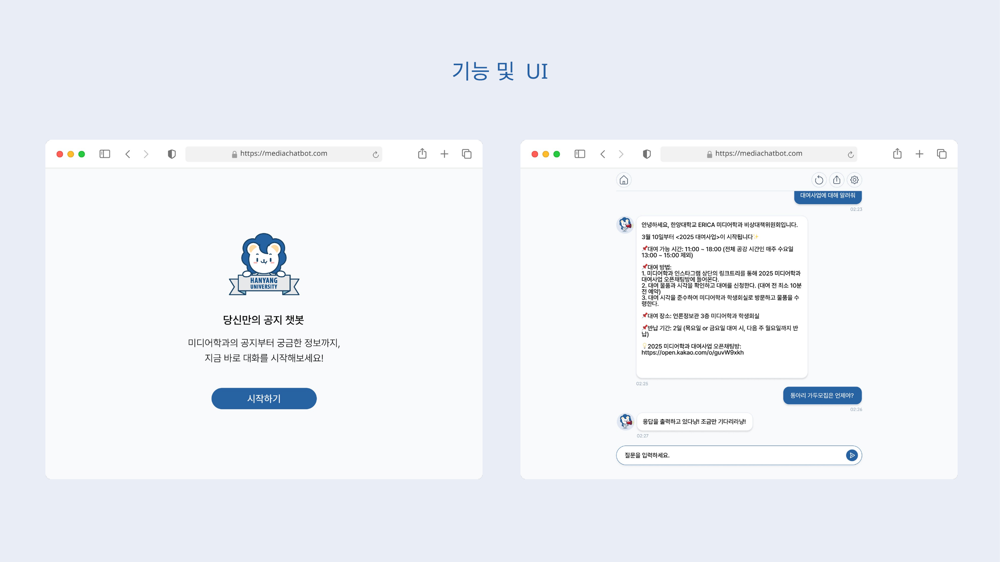
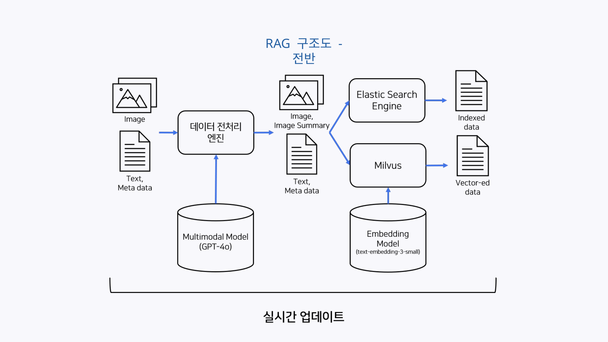
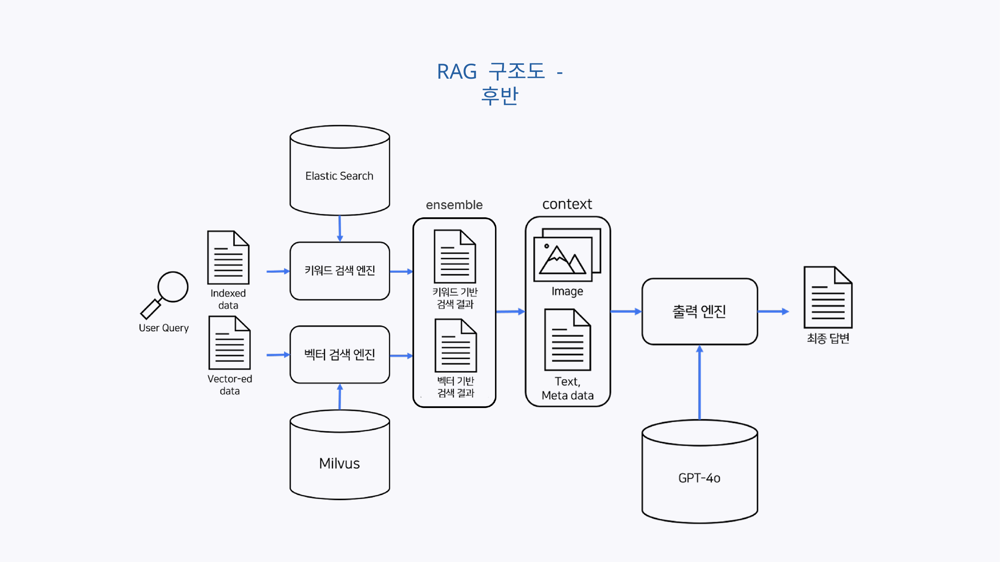
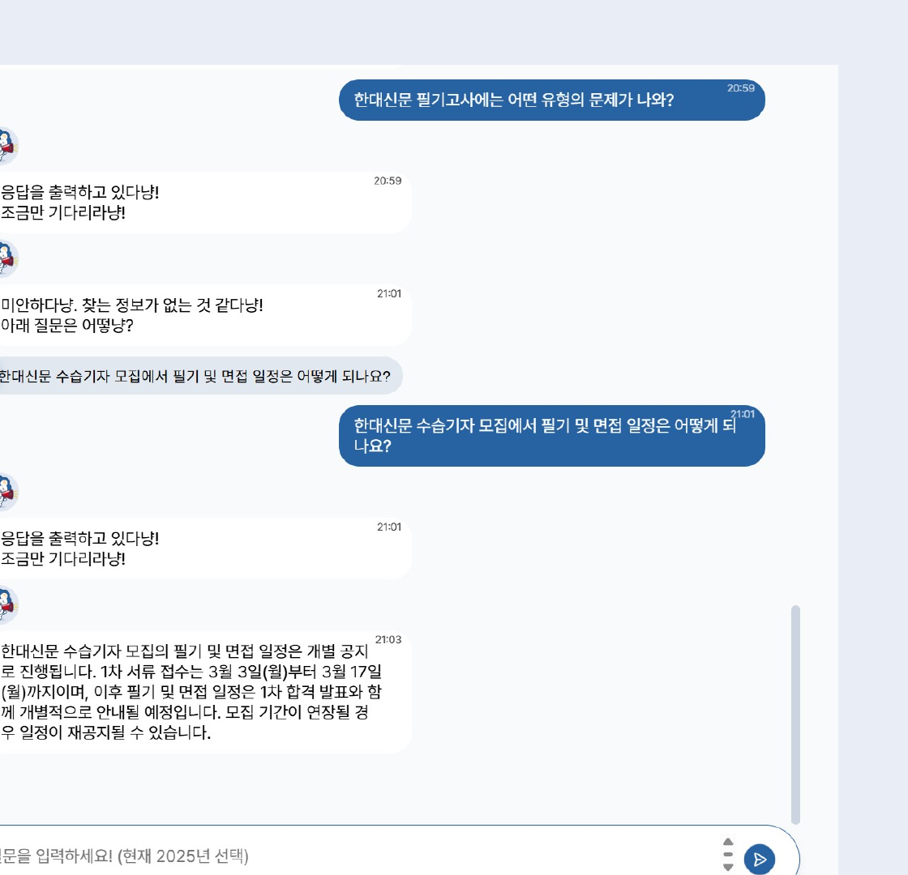

# 하이챗봇 (HY-Chatbot)

한양대학교 공지사항을 검색해서 답해주는 멀티모달 RAG 챗봇입니다. 텍스트 공지뿐 아니라 이미지로만 올라오는 공지(포스터, 카드뉴스 등)까지 이해하고 검색합니다.

한양대학교 캡스톤 프로젝트로 시작된 **팀 프로젝트**입니다. 이 프로젝트에서 제가 맡은 부분은 프로젝트 팀장, 초기 데이터 수집 및 전처리 모듈, 임베딩 벡터 기반 검색(Milvus/Zilliz), 하이브리드 검색 설계, 멀티모달(이미지) 검색, 재랭킹, LLM 최종 답변 생성입니다. 키워드 검색 (Elasticsearch), 프론트엔드/UI 제작 그리고 모델 통합은 팀원과 함께 하였습니다

(주)와이즈넛에서 필요한 서버 및 자원을 제공받았습니다.

## 화면



## 아키텍처

**데이터 수집·색인 파이프라인**



원본 공지(텍스트+이미지)를 전처리 엔진에 넣으면, 이미지는 GPT-4o(Multimodal Model)로 텍스트 요약을 만들고, 텍스트/요약 모두 임베딩 모델(text-embedding-3-small)로 벡터화됩니다. 결과물은 Elasticsearch(키워드 검색용)와 Milvus(벡터 검색용)에 동시에 색인됩니다.

**검색·답변 생성 파이프라인**



1. 사용자 질문을 **Elasticsearch**(키워드 검색 엔진)와 **Milvus**(벡터 검색 엔진)에 동시에 보냅니다.
2. 두 검색 결과를 점수 정규화 후 가중합(dense 0.7 : sparse 0.3)으로 앙상블(ensemble)해서 1차 랭킹을 만들고, 한국어 특화 reranker(`ko-reranker`)로 다시 정렬합니다.
3. 최종적으로 검색된 텍스트/이미지를 컨텍스트로 GPT-4o(출력 엔진)에 넣어 답변을 생성합니다. 검색 결과가 없으면 재질문을 유도하는 후속 질문도 함께 생성합니다.

## 검색 품질 개선

처음부터 검색이 잘 됐던 건 아닙니다. 실제로 F1 Score와 MRR(정답이 검색 결과 몇 번째에 오는지)로 측정해가며 문제를 찾고 고쳤습니다.

- **문제**: 이미지 공지가 실제로 관련 있어도 검색에서 누락되는 경우가 많았음 → 이미지 요약에 검색 키워드가 충분히 안 담겨서 발생. 요약 프롬프트를 개선해서 텍스트 MRR을 **0.691 → 0.907**로 끌어올림.
- **문제**: Elasticsearch 키워드 검색만으로 상위권에 못 드는 질문들이 있었음 → 재랭킹(reranking) 단계를 추가해서, 키워드 검색에서 4위였던 정답이 하이브리드+재랭킹을 거쳐 1위로 올라오는 걸 확인.
- **문제**: 검색 결과가 없는데도 LLM이 답을 지어내는 할루시네이션 발생 → 프롬프트에 "결과 없음" 처리 로직을 명시적으로 추가해서 해결.

## 검색 실패 시 후속 질문 제안 (Fallback)

할루시네이션을 없앤 대신, 검색 결과가 없으면 "미안하다냥. 찾는 정보가 없는 것 같다냥!"이라는 답만 나오고 대화가 끊기는 문제가 새로 생겼습니다. 사용자 입장에서는 뭘 다시 물어야 할지 몰라 막막해지는 지점입니다.

그래서 검색 실패가 감지되면, 원래 질문과 검색에 쓰였던 컨텍스트를 다시 LLM에 넘겨서 "이 사용자가 관심 있어할 만하고 실제로 답변 가능한" 후속 질문을 하나 생성하도록 만들었습니다(`qa.py`의 `img_prompt_additional`). 사용자는 그 추천 질문을 클릭만 해도 바로 다음 검색으로 이어갈 수 있어, 검색 실패 상황에서도 대화가 끊기지 않습니다.



## 구조

```
api-builder/   FastAPI 백엔드 (검색 파이프라인, 데이터 수집/색인)
ui/            프런트엔드 (순수 HTML/CSS/JS, 프레임워크 없음)
```

- `api-builder/app/utils/ela.py` — Elasticsearch/Milvus 검색
- `api-builder/app/utils/hybrid.py` — 점수 정규화 및 하이브리드 결합
- `api-builder/app/utils/reranking.py` — 재랭킹
- `api-builder/app/utils/qa.py` — GPT-4o 멀티모달 답변 생성
- `api-builder/app/utils/collection.py` — 공지 원본 수집/전처리/임베딩/색인
- `api-builder/app/api/routers/rest.py` — API 엔드포인트

## 실행하려면

이 프로젝트는 OpenAI API, Zilliz Cloud, Elasticsearch에 의존하는 RAG 시스템이라 본인의 API 키/인프라 없이는 그대로 돌아가지 않습니다. 코드 구조와 파이프라인 설계를 참고하는 용도로 봐주세요.

```bash
cd api-builder
cp .env.example .env   # 값 채우기 (OpenAI, Zilliz, Elasticsearch)
uv sync
uv run uvicorn app.main:app --host 0.0.0.0 --port 27500
```

`ui/` 아래 HTML 파일들은 별도 빌드 없이 브라우저로 바로 열어보거나, 정적 파일 서버로 서빙하면 됩니다. 단, 백엔드 API 주소를 각 HTML 안의 `fetch()` 호출부에서 본인 서버 주소로 바꿔야 합니다.

## 알려진 제약

- 프로젝트를 실제로 서빙하던 서버는 현재 운영을 종료했습니다. Elasticsearch에 색인되어 있던 공지 데이터는 로컬(`127.0.0.1`)에서만 접근 가능했고 별도로 백업되어 있지 않아, 재현하려면 원본 공지 데이터를 다시 수집/색인해야 합니다.
- 관리자 로그인(`관리자화면.html`)은 프런트엔드 자바스크립트로만 비밀번호를 검증하는 데모 수준 구현입니다. 실제 서비스라면 서버 사이드 인증으로 교체가 필요합니다.

## 라이선스

`api-builder/`의 기본 프로젝트 골격은 Wisenut의 Python FastAPI Template(비상업적 사용 허용, `api-builder/LICENSE` 참고)을 기반으로 합니다. 검색 파이프라인, 하이브리드 서치, 재랭킹, 멀티모달 답변 생성, 프런트엔드 등 실제 챗봇 로직은 팀에서 직접 구현했습니다.
